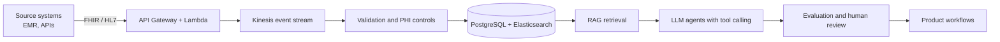

<h1 align="center">Ujwala Bheema</h1>

<b>Engineering Manager</b> · Distributed Systems · Agentic AI · Healthcare Interoperability

14+ years building and leading production engineering: Ruby on Rails, AWS, React, and AI/data systems.

 

<table align="center">
<tr>
<td align="center"><h2>+50%</h2>client onboarding rate driving revenue growth</td>
<td align="center"><h2>-60%</h2>manual processes via governed agentic AI</td>
<td align="center"><h2>+25%</h2>deployment frequency through CI/CD optimization</td>
<td align="center"><h2>95%</h2>SLA compliance on FHIR / HL7 APIs</td>
</tr>
</table>

<i>ChartRequest (first three) and Cerner (SLA). Back-to-back CEO recognition at ChartRequest for sustained, high-impact delivery.</i>

 

## Engineering leader who still designs the system

I lead engineering at **ChartRequest**, a healthcare data exchange company, where I own delivery of agentic AI and LLM platforms: prompt pipelines, tool calling, RAG over structured and unstructured healthcare data, and multi-step agent orchestration, taken from prototype to production under governance and measurable success criteria.

Before that: **Cerner** (FHIR and HL7 interoperability, API design), **Rakuten** (a booking platform built from scratch with zero major production incidents for 12+ months), and **Smartzip** (Principal Engineer: OAuth, JWT and SSO security, high-availability migrations).

 

## How I work

| Role | What it covers |
| --- | --- |
| **Lead** | Hiring, performance management, roadmaps, sprint execution, cross-geo teams, clear trade-offs for senior leadership |
| **Architect** | Event-driven and distributed systems on AWS (Lambda, Kinesis, API Gateway, EC2), REST APIs, microservices, performance and scalability |
| **Ship AI safely** | RAG, tool calling, agent orchestration, evaluation patterns, AI governance and adoption |
| **Build trust** | HIPAA-aware design, OAuth2, JWT, SSO, code review, test automation, incident management |

 

## Reference pattern: governed agentic AI over healthcare data

A generic architecture pattern I design for, not employer-specific.

 

## Selected work

| Project | What it shows |
| --- | --- |
| [aws-event-driven-ingestion-reference](https://github.com/UjwalaBheema/aws-event-driven-ingestion-reference) | Tested reference architecture for multi-tenant event ingestion: API Gateway, Lambda, Kinesis, DynamoDB, idempotent consumers, dead-letter queue, decision record |
| [rag-genai-assignments](https://github.com/UjwalaBheema/rag-genai-assignments) | RAG from first principles to working apps: vector databases, advanced retrieval, Gradio front ends, web-search-augmented answers |

More reference implementations are on the way, including an evaluation-first RAG service and an engineering leadership playbook.

 

## Stack

**Backend** Ruby, Rails, REST APIs, PostgreSQL, MySQL, Redis, Elasticsearch  
**Frontend** React, JavaScript  
**Cloud** AWS Lambda, Kinesis, API Gateway, EC2, Docker, CI/CD  
**AI and data** LLM integrations, RAG, agent orchestration, MCP, n8n, Python, scikit-learn, TensorFlow, PyTorch, NLP, PySpark

 

## Education

Master of Data Science, Deakin University · PG Program in AI and Machine Learning, Great Lakes Institute of Management · B.E. Information Technology, JNTU Hyderabad · AI Engineering Accelerator (agents, multi-agent systems, MCP), Outskill, 2026

 

## Open to

Engineering Manager, Senior Engineering Manager, AI Engineering Manager and Staff or Principal Engineer roles. Based in India; open to remote roles and to relocation or hybrid roles in the US, Germany and Ireland.
